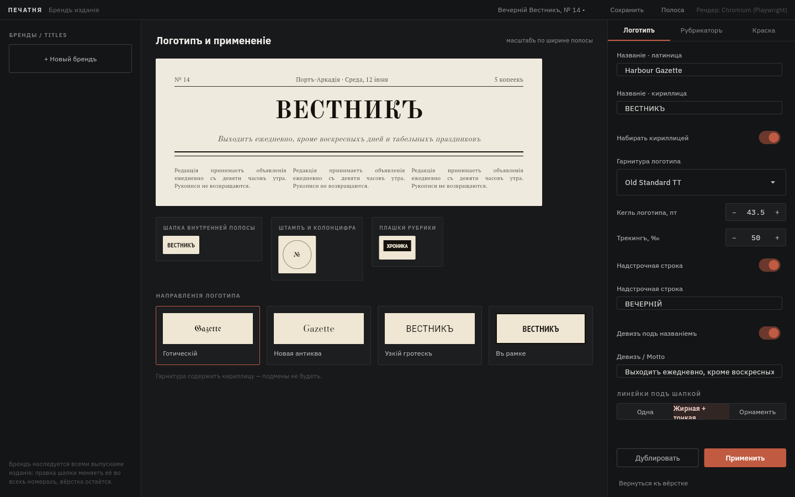

# Печатня — конструктор игровых газет

Десктопное приложение (Python + Flet) для настольных и ролевых игр: мастер
собирает выпуск вымышленной газеты — заполняет карточку издания, верстает
полосы из блоков, пишет статьи, накладывает эффект состаренной бумаги и
выгружает PNG для чата или PDF для печати.

Работает полностью офлайн: шрифты лежат в комплекте, рендер идёт локально,
сетевых запросов в рантайме нет.


## Что уже умеет

| Раздел ТЗ | Реализация |
|---|---|
| 4.1 Издание и выпуск | Карточка выпуска (название, слоган, номер, дата, цена, город, число полос), проект в JSON, список недавних, новый номер с наследованием оформления |
| 4.2 Стили | Пять пресетов («классическая пресса», «таблоид», «официальный вестник», «партийная агитка», «подпольный листок»), ручная правка гарнитур, кеглей, линеек, красок; свои пресеты сохраняются в профиле |
| 4.3 Макет | Шесть шаблонов сетки, перетаскивание границ блоков мышью, многостраничные выпуски, передние и внутренние полосы, «продолжение на стр. N» |
| 4.4 Текст | Минимальная разметка (`**жирный**`, `*курсив*`, `## подзаголовок`, `> врезка`), перетекание по колонкам, выключка, переносы, буквица с капителью, индикация переполнения в знаках |
| 4.5 Изображения | Вставка файлов в блок с копированием в папку проекта, подпись, высота в блоке, фильтры «полутон / сепия / ч-б» |
| 4.6 Состаривание | Тумблер + ползунок 0…100 и раздельные слои: желтизна, пятна, неравномерность оттиска, заломы, зерно скана |
| 4.7 Экспорт | PNG (96/150/300/600 dpi, все полосы / текущая / диапазон, склейка в одну картинку) и PDF всего выпуска (A4 или A3), метки реза |
| 4.8 Хранение | `<имя>.pechatnya.json` + папка `<имя>.images` рядом, автосохранение с отметкой времени в статус-баре |

Девять экранов из дизайн-пакета собраны: список проектов, карточка издания,
пресеты, шаблоны сетки, главный экран вёрстки, редактор статьи, панели
типографики и бумаги, диалог экспорта, экран бренда издания.

## Установка и запуск

Нужен Python 3.11 или новее.

```bash
pip install -r requirements.txt
python -m playwright install chromium   # необязательно, см. ниже
python -m pechatnya
```

Полоса рендерится движком Chromium. Приложение ищет его так:

1. переменная `PECHATNYA_BROWSER` (полный путь к `chrome.exe` / `msedge.exe`);
2. браузер, установленный `playwright install chromium`;
3. системный Google Chrome, Chromium или Microsoft Edge — на Windows 10/11
   Edge есть всегда, поэтому шаг 2 можно пропустить.

С Playwright доступен замер вместимости блоков (проценты заполнения и остаток
в знаках); в режиме системного браузера остаются рендер превью и экспорт.
Текущий режим виден в правом верхнем углу окна.

## Как устроен проект

```
pechatnya/
  models.py          структура выпуска: бренд, издание, полосы, блоки, статьи
  presets.py         пресеты оформления, шаблоны сеток, демо-выпуск
  storage.py         файлы проектов, недавние, бренды, свои пресеты
  fonts.py           встроенные гарнитуры и системные шрифты
  render/
    html.py          сборка HTML полосы по метрикам дизайн-пакета
    paper.py         слой состаривания бумаги
    engine.py        headless-Chromium: PNG, PDF, замер блоков
    export.py        экспорт выпуска, имена файлов, склейка
  ui/                экраны Flet, панели, превью, состояние приложения
assets/fonts/        восемь гарнитур (SIL OFL 1.1) + лицензии
design/              исходный дизайн-пакет и ТЗ
docs/ARCHITECTURE.md почему полоса рендерится в HTML, а не на канвасе Flet
```

Проверка:

```bash
python -m pytest tests -q
```

Тесты движка рендера пропускаются, если в системе нет браузера.

## Шрифты

В комплекте: IBM Plex Sans, IBM Plex Mono, Old Standard TT, PT Serif,
PT Sans Narrow, Oswald, UnifrakturMaguntia, Bodoni Moda — все под SIL Open
Font License 1.1, тексты лицензий в `assets/fonts/licenses`. Обновить комплект:
`python tools/fetch_fonts.py`.

UnifrakturMaguntia и Bodoni Moda не содержат кириллицы: для кириллических
названий приложение подставляет Old Standard TT и предупреждает об этом в
панели бренда.

## Скриншоты

| | |
|---|---|
|  |  |
|  |  |

Готовая полоса (экспорт PNG): `docs/screenshots/sheet.png`.
