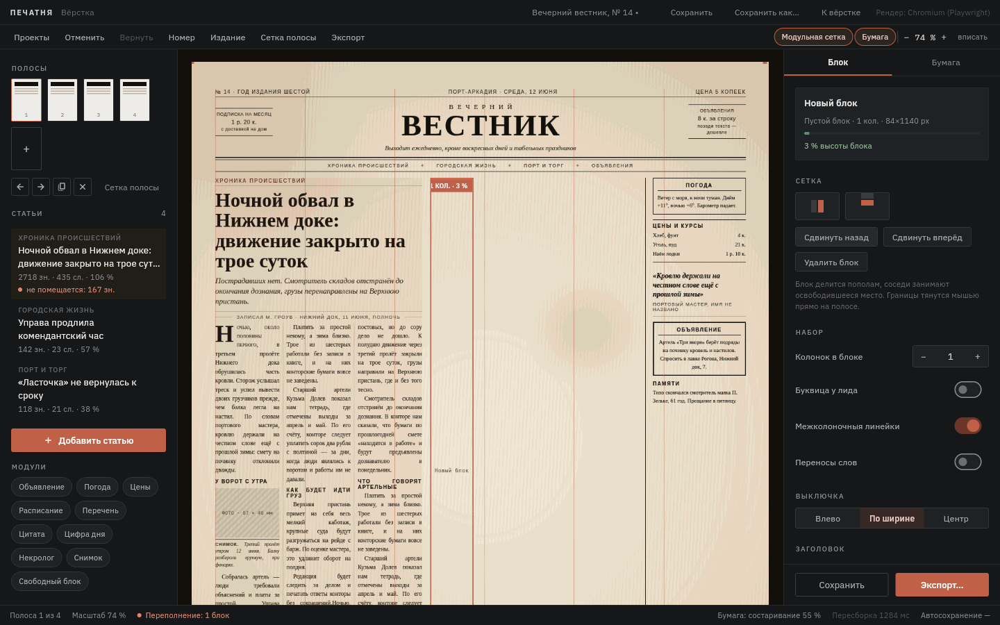
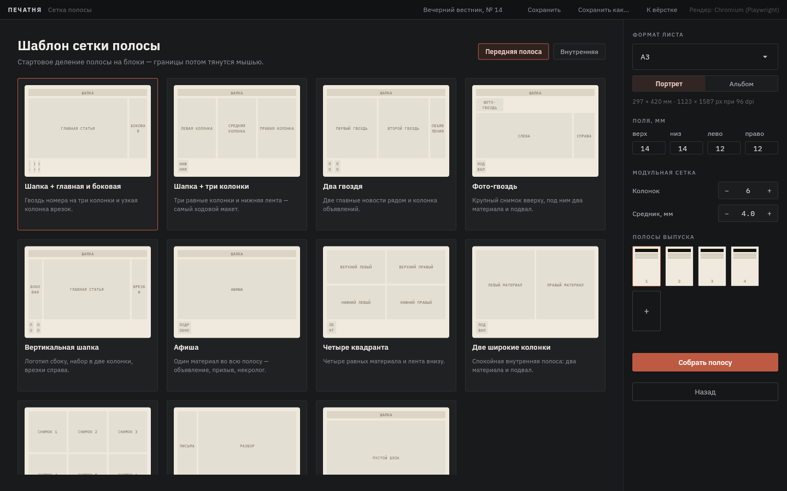
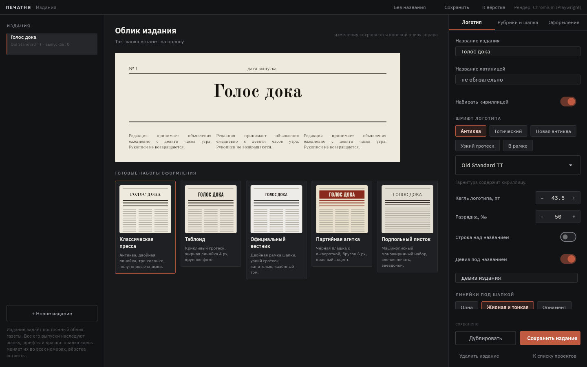
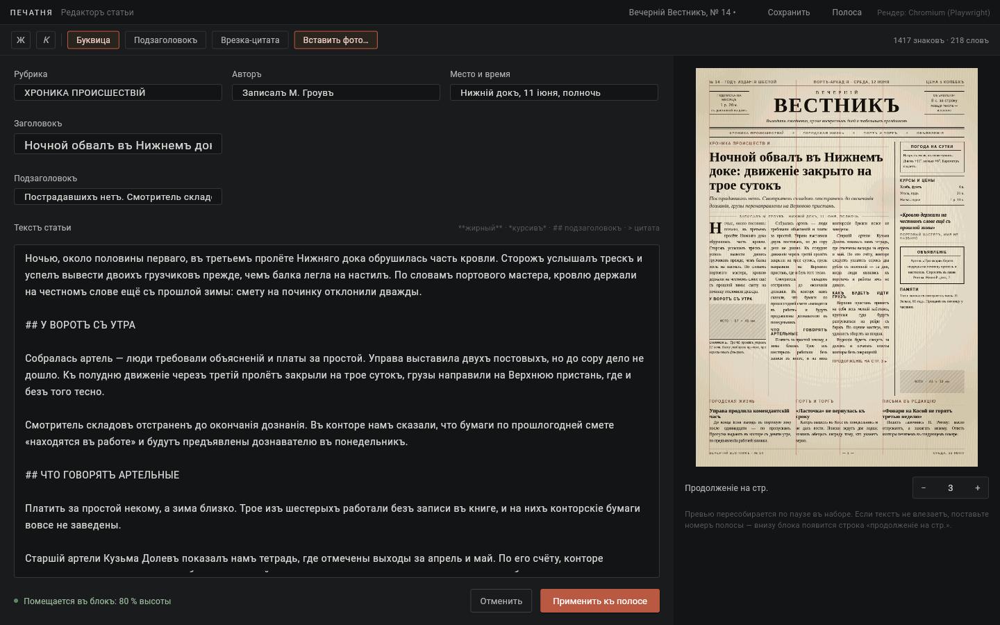
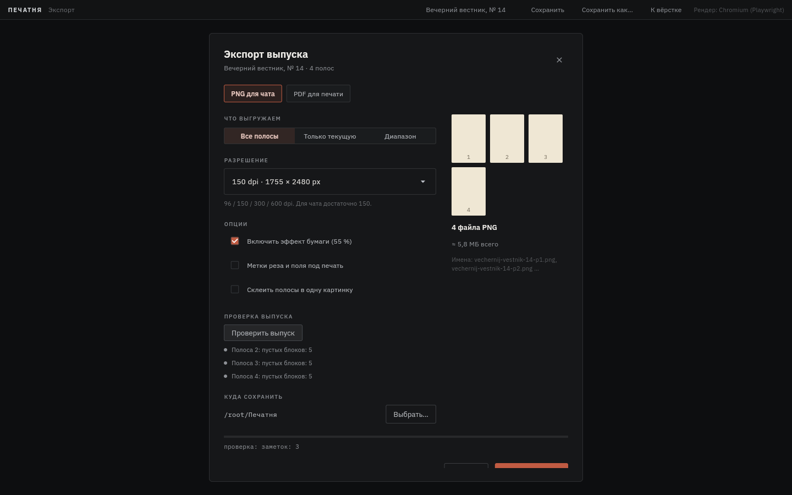
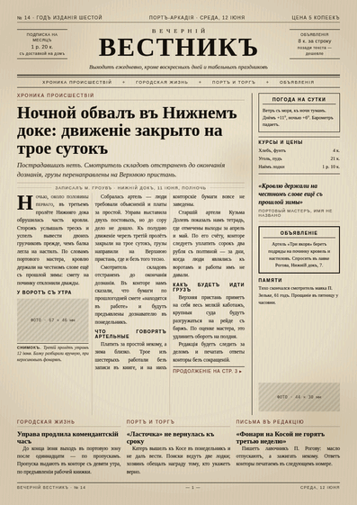

# Печатня — конструктор игровых газет

Десктопное приложение (Python + Flet) для настольных и ролевых игр: мастер
придумывает своё издание — логотип, шрифты, краски, — выпускает его номера,
верстает полосы из блоков, пишет статьи, накладывает эффект состаренной бумаги
и выгружает PNG для чата или PDF для печати.

Никакого готового содержимого программа не подставляет: газета целиком ваша.

Работает полностью офлайн: шрифты лежат в комплекте, рендер идёт локально,
сетевых запросов в рантайме нет.



## Как устроена работа

1. **Издание** — постоянный облик газеты: название, логотип, девиз, рубрики,
   служебные строки шапки, шрифты, кегли и краски. Хранится в библиотеке
   приложения, редактируется на отдельном экране.
2. **Выпуск** — номер этого издания: дата, цена, полосы, материалы. Выпуск
   наследует облик издания, поэтому правка логотипа или шрифтов меняет шапку
   во всех номерах сразу, а вёрстка остаётся нетронутой.
3. **Полоса** собирается из блоков: в блок кладётся статья или служебные модули
   (объявление, погода, цены, цитата, некролог, снимок). Содержимое модулей
   пишете вы — заготовок с чужим текстом нет.
4. **Длинный материал** делится между полосами: выберите полосу и нажмите
   «Перенести остаток» — программа замерами подберёт точку разрыва так, чтобы
   начало ровно влезло в блок, и поставит строки «продолжение на стр.» и
   «начало на стр.».

## Конструктор полосы

Сетка полосы — дерево блоков, а не готовый набор клеток. Любой блок можно
разделить по вертикали или горизонтали, удалить, переставить местами с соседом
или добавить новый; границы тянутся мышью прямо на полосе, соседи занимают
освободившееся место, текст тут же перетекает.

| | |
|---|---|
| Сетка | 11 шаблонов как отправная точка, дальше — деление и перестановка блоков вручную, привязка к модульной сетке, свои сохранённые сетки |
| Лист | A3, A4, A5, таблоид, бродлист, листовка или свой размер в мм; портрет и альбом; поля в миллиметрах |
| Блок | колонки и средник, выключка, переносы, буквица, кегль текста, масштаб заголовка, рамка (тонкая, двойная, жирная), плашка-подложка, внутренний отступ |
| Модули | объявление, погода, цены, расписание, перечень, цитата, цифра дня, некролог, снимок, свободный блок — всё с редактируемым содержимым |
| Полосы | добавить, дублировать, переставить, удалить; у каждой полосы своя сетка |

Границы прилипают к модульной сетке: по горизонтали — к колонкам, по вертикали —
к строкам набора, поэтому колонки не «плавают» на доли пикселя. Привязку можно
выключить тумблером в строке меню. Собранную сетку можно сохранить своим
шаблоном и применять к другим полосам и выпускам.

Масштаб превью — кнопкой «вписать» или шагами; лист любого формата рисуется
целиком, а не обрезается.

## Наборная типографика

Полоса набирается так, как это делают в типографии, а не так, как текст попал
в поле ввода:

- прямые кавычки становятся «ёлочками», дефис между словами — тире,
  три точки — многоточием;
- короткие предлоги и союзы, инициалы, «№ 14», «т. д.» и единицы измерения
  связываются неразрывным пробелом — предлог не остаётся один в конце строки;
- разряды чисел разделяются тонким пробелом;
- блок обрезает текст по целой строке: половины строки внизу блока не бывает.

Всё это происходит при вёрстке полосы — текст статьи в проекте остаётся ровно
таким, каким его набрали, и любую правку можно выключить в оформлении издания.

## Проверка перед выгрузкой

В диалоге экспорта есть кнопка «Проверить выпуск»: она обходит все полосы и
показывает, где текст не поместился, какие снимки потерялись, какие модули
остались пустыми и какие статьи забыли поставить на полосу.

## Что уже умеет

| Раздел ТЗ | Реализация |
|---|---|
| 4.1 Издание и выпуск | Библиотека изданий (создать, дублировать, удалить), выпуск номера с наследованием облика, проект в JSON, список недавних с фильтром по изданию |
| 4.2 Стили | Пять наборов оформления («классическая пресса», «таблоид», «официальный вестник», «партийная агитка», «подпольный листок») и ручная правка гарнитур, кеглей, линеек, красок — всё в редакторе издания |
| 4.3 Макет | 11 шаблонов сетки, деление и удаление блоков, перестановка, перетаскивание границ мышью, форматы листа от A5 до бродлиста и свой размер, поля в мм, многостраничные выпуски с дублированием полос |
| 4.4 Текст | Минимальная разметка (`**жирный**`, `*курсив*`, `## подзаголовок`, `> врезка`), перетекание по колонкам, выключка, переносы, буквица с капителью, индикация переполнения в знаках, перенос остатка на другую полосу с автоподбором точки разрыва |
| 4.5 Изображения и модули | Вставка файлов в блок с копированием в папку проекта, подпись, высота в блоке, фильтры «полутон / сепия / ч-б»; модули полосы (объявление, погода, цены, цитата, некролог, снимок) добавляются пустыми и заполняются в панели «Блок» |
| 4.6 Состаривание | Тумблер + ползунок 0…100 и раздельные слои: желтизна, пятна, неравномерность оттиска, заломы, зерно скана |
| 4.7 Экспорт | PNG (96/150/300/600 dpi, все полосы / текущая / диапазон, склейка в одну картинку) и PDF всего выпуска в выбранном формате листа, метки реза, проверка выпуска перед выгрузкой |
| 4.8 Хранение | `<имя>.pechatnya.json` + папка `<имя>.images` рядом, «сохранить как» с переносом картинок, отмена и возврат правок (Ctrl+Z / Ctrl+Shift+Z), автосохранение с отметкой времени в статус-баре |

Экраны: список проектов, мастер выпуска из двух шагов (данные номера → сетка
полосы), главный экран вёрстки с живым превью, редактор статьи, редактор
издания, диалог экспорта.

## Установка и запуск

Нужен Python 3.11 или новее.

```bash
pip install -r requirements.txt
python -m playwright install chromium   # необязательно, см. ниже
python -m pechatnya
```

Полоса рендерится движком Chromium. Приложение ищет его так:

1. переменная `PECHATNYA_BROWSER` (полный путь к `chrome.exe` / `msedge.exe`);
2. браузер, установленный `playwright install chromium`;
3. системный Google Chrome, Chromium или Microsoft Edge — на Windows 10/11
   Edge есть всегда, поэтому шаг 2 можно пропустить.

С Playwright доступен замер вместимости блоков (проценты заполнения и остаток
в знаках); в режиме системного браузера остаются рендер превью и экспорт.
Текущий режим виден в правом верхнем углу окна.

## Как устроен проект

```
pechatnya/
  models.py          издание, выпуск, полосы, блоки, статьи, модули
  presets.py         наборы оформления, шаблоны сеток, пустые модули
  storage.py         файлы проектов, недавние, библиотека изданий
  fonts.py           встроенные гарнитуры и системные шрифты
  render/
    html.py          сборка HTML полосы по метрикам дизайн-пакета
    paper.py         слой состаривания бумаги
    engine.py        headless-Chromium: PNG, PDF, замер блоков
    split.py         подбор точки разрыва для «продолжения на стр. N»
    export.py        экспорт выпуска, имена файлов, склейка
  ui/                экраны Flet, панели, превью, состояние приложения
tests/fixtures.py    образец свёрстанного выпуска — только для тестов
assets/fonts/        восемь гарнитур (SIL OFL 1.1) + лицензии
design/              исходный дизайн-пакет и ТЗ
docs/ARCHITECTURE.md почему полоса рендерится в HTML, а не на канвасе Flet
```

## Горячие клавиши

| | |
|---|---|
| Ctrl+S / Ctrl+Shift+S | сохранить · сохранить как |
| Ctrl+Z / Ctrl+Shift+Z | отменить · вернуть |
| Ctrl+N · Ctrl+E | новый выпуск · экспорт |

## Проверка

```bash
python -m pytest tests -q
```

68 тестов: модель и формат проекта, сборка полосы, экспорт, хранение файлов,
состояние приложения (отмена, сохранение, издания), геометрия вёрстки и сборка
всех экранов — каждый экран прогоняется через ту же проверку контролов, что
делает Flet перед отрисовкой. Тесты движка рендера пропускаются, если в системе
нет браузера.

## Шрифты

В комплекте: IBM Plex Sans, IBM Plex Mono, Old Standard TT, PT Serif,
PT Sans Narrow, Oswald, UnifrakturMaguntia, Bodoni Moda — все под SIL Open
Font License 1.1, тексты лицензий в `assets/fonts/licenses`. Обновить комплект:
`python tools/fetch_fonts.py`.

UnifrakturMaguntia и Bodoni Moda не содержат кириллицы: для кириллических
названий приложение подставляет Old Standard TT и предупреждает об этом в
панели бренда.

## Скриншоты

| | |
|---|---|
|  |  |
|  |  |
|  |  |

Готовая полоса (экспорт PNG): `docs/screenshots/sheet.png`.
